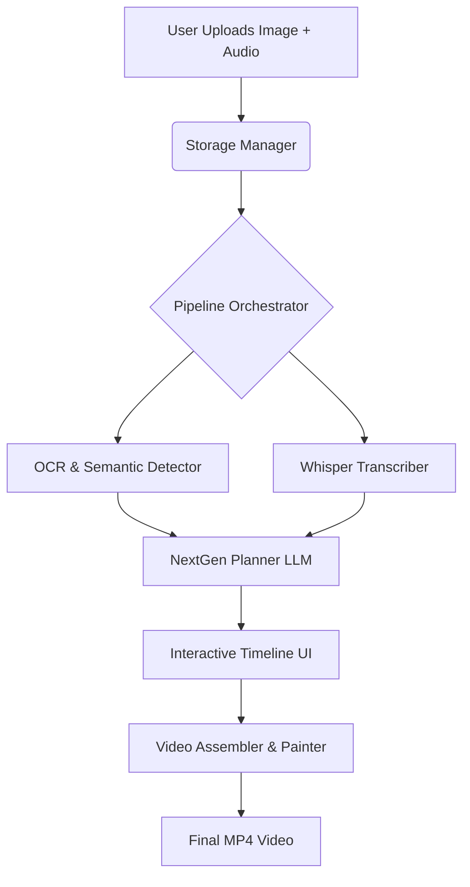
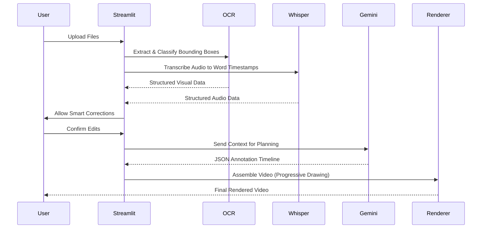

# ExplainInk AI 🚀

ExplainInk AI is a production-grade educational video automation platform. It takes a raw question image and teacher narration, and generates a fully synchronized, animated explainer video automatically using state-of-the-art LLMs and Computer Vision.

## 🌟 Key Features
- **Semantic OCR**: Classifies image regions into math formulas, diagrams, and text using Gemini Vision.
- **Smart Planning**: Context-aware LLM generates a logical timeline of drawing actions (highlights, arrows, handwriting).
- **Teacher Analytics**: Analyzes pedagogical quality, speaking speed (WPM), and provides a comprehensive explanation summary.
- **Human-in-the-Loop**: Interactive Streamlit UI allows manual correction of OCR and transcripts before video rendering.

## 🏗️ Architecture



## 🔄 Data Flow



## ⚙️ Setup & Deployment

1. **Install Dependencies**: `pip install -r requirements.txt`
2. **Environment Setup**: Add your `GEMINI_API_KEY` to a `.env` file.
3. **Run Locally**: `streamlit run app.py`

### Docker Deployment
Run using Docker Compose:
```bash
docker-compose up --build
```
Access the application at `http://localhost:8501`.

## 📚 Documentation Directory
- [System Design](docs/system_design.md)
- [Architecture Details](docs/architecture.md)
- [Scaling Strategy](docs/scaling_strategy.md)
- [Interview Notes (Design Decisions & Trade-offs)](docs/interview_notes.md)
